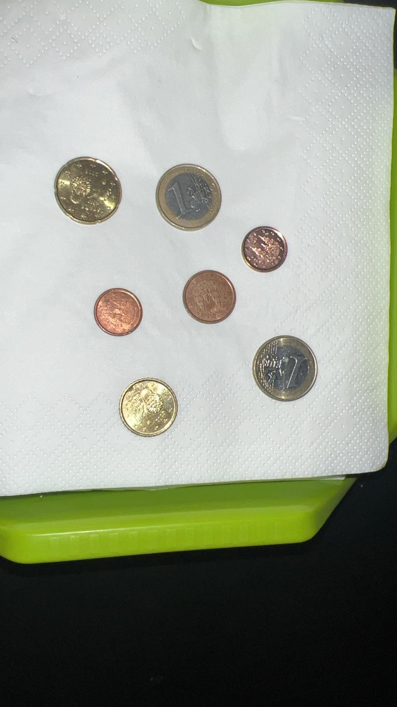

# Ejercicio 1: Detección Interactiva de Monedas con OpenCV

Este proyecto permite identificar monedas en una imagen y calcular la cantidad total de dinero presente. El programa utiliza la librería OpenCV para el procesamiento de imágenes, y se puede interactuar con la imagen haciendo clic sobre una moneda de referencia (por ejemplo, una moneda de 1€), a partir de la cual se identifican todas las demás monedas en la imagen, calculando su valor total. 

## Descripción del Funcionamiento

### Objetivo

El objetivo de este programa es identificar monedas en una imagen, contarlas y determinar la cantidad total de dinero. El programa sigue los siguientes pasos:

1. **Carga de la imagen**: Se carga la imagen que contiene monedas no solapadas.
2. **Preprocesamiento de la imagen**:
   - Se convierte la imagen original a escala de grises.
   - Se aplica un suavizado con un filtro Gaussiano y otro con un filtro de mediana para reducir el ruido y mejorar la detección de los bordes.
3. **Detección de círculos**: Se usa la técnica de detección de círculos de Hough para encontrar las monedas en la imagen.
4. **Interactividad**: El usuario selecciona una moneda de referencia en la imagen (haciendo clic sobre una moneda conocida, por ejemplo, de 1€).
5. **Calibración y cálculo**: A partir de la moneda seleccionada, el programa calcula el tamaño de las demás monedas en la imagen, las clasifica según su diámetro y calcula el valor total de dinero en la imagen.
6. **Resultados**: El programa muestra los resultados por consola, incluyendo el valor total encontrado y una comparación entre las monedas reales y las detectadas.


### Pasos del Algoritmo

1. **Carga y conversión de imagen**:
   ```python
   img = cv2.imread('monedas2.jpeg')
   img_rgb = cv2.cvtColor(img, cv2.COLOR_BGR2RGB)
   gris = cv2.cvtColor(img, cv2.COLOR_BGR2GRAY)
   ```

2. **Suavizado de imagen**:
   Se aplican filtros para reducir el ruido y mejorar la precisión de la detección:
   ```python
   softenedImage = cv2.medianBlur(gris, 7)
   softenedImage2 = cv2.GaussianBlur(softenedImage, (5, 5), 1)
   ```

3. **Detección de círculos**:
   El programa utiliza la transformada de Hough para detectar los círculos (monedas):
   ```python
   circles = locateCirclesInIMG(softenedImage2)
   ```

4. **Interacción del usuario**:
   El usuario selecciona una moneda de referencia haciendo clic en la imagen:
   ```python
   cv2.setMouseCallback('Monedas', mouse_callback)
   ```

5. **Identificación y cálculo**:
   A partir de la moneda seleccionada, se calculan los tamaños de las demás monedas en la imagen, y se clasifican según su diámetro en diferentes tipos de monedas.
   
6. **Resultados**:
   El programa imprime por consola:
   - El valor total encontrado.
   - Comparación entre el número de monedas reales (esperadas) y las monedas detectadas.
   ```python
   showResults(moneyAmount, realMoneyAmount, coinCount, realCoinCount)
   ```

### Funciones Principales

- `locateCirclesInIMG(img)`: Detecta los círculos en la imagen utilizando la transformada de Hough.
- `coinDiameterInPixels(coin)`: Calcula el diámetro de una moneda en píxeles.
- `pixelMeasurementInCM(coinDiameterInPixels, coinDiameterInCM)`: Convierte el diámetro de píxeles a centímetros.
- `moneyCalculator(coins)`: Calcula el valor total de las monedas detectadas.
- `showResults(moneyAmount, realMoneyAmount, coinCount, realCoinCount)`: Muestra los resultados finales, incluyendo el valor total encontrado y las diferencias entre las monedas esperadas y las detectadas.

### Ejemplo de Ejecución



- El usuario selecciona una moneda de 1€ en la imagen haciendo clic sobre ella.
- El programa detecta y clasifica el resto de las monedas.
- Se imprime el siguiente resultado en la consola:

```
=== Resultados de Detección de Monedas ===
Dinero total real (esperado): 2.34 €
Dinero total encontrado: 2.34 €

Monedas reales (esperadas):
Moneda de 2.00 €: 0 unidades
Moneda de 1.00 €: 2 unidades
Moneda de 0.50 €: 0 unidades
Moneda de 0.20 €: 1 unidades
Moneda de 0.10 €: 1 unidades
Moneda de 0.05 €: 0 unidades
Moneda de 0.02 €: 1 unidades
Moneda de 0.01 €: 2 unidades

Monedas encontradas (detectadas):
Moneda de 2.00 €: 0 unidades
Moneda de 1.00 €: 2 unidades
Moneda de 0.50 €: 0 unidades
Moneda de 0.20 €: 1 unidades
Moneda de 0.10 €: 1 unidades
Moneda de 0.05 €: 0 unidades
Moneda de 0.02 €: 1 unidades
Moneda de 0.01 €: 2 unidades

Diferencias entre monedas reales y encontradas:
Moneda de 2.00 €: sin diferencia
Moneda de 1.00 €: sin diferencia
Moneda de 0.50 €: sin diferencia
Moneda de 0.20 €: sin diferencia
Moneda de 0.10 €: sin diferencia
Moneda de 0.05 €: sin diferencia
Moneda de 0.02 €: sin diferencia
Moneda de 0.01 €: sin diferencia

==========================================
```

### Problemas Observados

1. **Solapamiento de Monedas**: El programa puede tener dificultades al detectar monedas que están solapadas, ya que la técnica de Hough puede no distinguir bien los bordes.
2. **Monedas Similares en Tamaño**: Si dos monedas tienen un diámetro muy similar, pueden ser clasificadas incorrectamente, especialmente si la imagen tiene ruido o el suavizado no es adecuado.
3. **Iluminación y Reflejos**: Variaciones en la iluminación o reflejos sobre las monedas pueden afectar a la precisión del algoritmo de detección de bordes, provocando que algunas monedas no se detecten correctamente.

### Librerías Utilizadas

- **OpenCV**: Para el procesamiento de imágenes, detección de bordes y transformación de Hough.
- **NumPy**: Para manipular matrices y realizar cálculos con los píxeles de la imagen.
- **Matplotlib**: Para la visualización opcional de las imágenes (aunque no es utilizado directamente en este código).

### Requisitos

- Python 3.x
- OpenCV (`pip install opencv-python`)
- NumPy (`pip install numpy`)


# Ejercicio 2: Detección de Fragmentos en Imágenes con OpenCV

Este proyecto permite identificar y clasificar fragmentos en imágenes, como microplásticos, pellets y alquitrán, utilizando la librería OpenCV para el procesamiento de imágenes. A través de una combinación de técnicas de umbralización adaptativa, operaciones morfológicas y clasificación basada en características geométricas y de color, el programa detecta y separa distintos tipos de fragmentos.

## Descripción del Funcionamiento

### Objetivo

El objetivo de este programa es detectar fragmentos en imágenes, clasificarlos según su tipo (pellets, fragmentos de microplásticos y alquitrán), y mostrar los resultados de detección en la imagen original. El proceso sigue estos pasos:

1. **Carga de la imagen**: Se carga la imagen que contiene los fragmentos a detectar.
2. **Preprocesamiento de la imagen**:
   - Conversión de la imagen a escala de grises.
   - Aplicación de un suavizado con un filtro Gaussiano para reducir el ruido y mejorar la detección de contornos.
   - Umbralización adaptativa gaussiana para segmentar los fragmentos de la imagen.
3. **Detección y filtrado de contornos**: Se detectan los contornos de los fragmentos y se filtran aquellos demasiado pequeños o cercanos.
4. **Clasificación de fragmentos**: Se clasifican los fragmentos en tres categorías: pellets, fragmentos de microplásticos y alquitrán, basándose en su área, circularidad y color.
5. **Resultados**: Se visualiza la imagen con los fragmentos detectados, coloreados según su clasificación.

### Pasos del Algoritmo

1. **Carga y conversión de imagen**:
   ```python
   imagen = cv2.imread('imagen.jpg')
   imagen_gray = cv2.cvtColor(imagen, cv2.COLOR_BGR2GRAY)
   ```

2. **Suavizado y umbralización**:
   Se aplica un filtro Gaussiano para suavizar la imagen y luego se realiza una umbralización adaptativa:
   ```python
   imagen_suavizada = cv2.GaussianBlur(imagen_gray, (7, 7), 0)
   imagen_umbral = cv2.adaptiveThreshold(
       imagen_suavizada, 255, cv2.ADAPTIVE_THRESH_GAUSSIAN_C,
       cv2.THRESH_BINARY, 11, 1
   )
   ```

3. **Detección de contornos**:
   Después de aplicar operaciones morfológicas para eliminar ruido, se detectan los contornos de los fragmentos:
   ```python
   contornos_gaussian, _ = cv2.findContours(255-imagen_umbral, cv2.RETR_EXTERNAL, cv2.CHAIN_APPROX_SIMPLE)
   ```

4. **Clasificación de fragmentos**:
   Los fragmentos detectados se clasifican según su área, circularidad y color. El programa distingue entre:
   - **Pellets**: Fragmentos grandes y redondos.
   - **Fragmentos de microplásticos**: Fragmentos de formas irregulares.
   - **Alquitrán**: Fragmentos oscuros.
   
   ```python
   def clasificar_fragmento(area, circularidad, contorno, colorPixel):
       if isBlack(colorPixel):
           Particulas['Alquitrán'] +=1
       elif circularidad > 0.70 and area > 75:
           Particulas['Pellet'] +=1
       else:
           Particulas['Fragmento de microplástico'] +=1
   ```

5. **Resultados**:
   Los fragmentos detectados se dibujan en la imagen original con diferentes colores, según su clasificación:
   ```python
   cv2.drawContours(imagen_contornos, pellet, -1, (255, 0, 0), 2)
   cv2.drawContours(imagen_contornos, plastic, -1, (0, 255, 0), 2)
   cv2.drawContours(imagen_contornos, alqui, -1, (0, 0, 255), 2)
   ```

### Funciones Principales

- `ResizeWithAspectRatio(image, width=None, height=None)`: Redimensiona la imagen manteniendo la relación de aspecto.
- `distancia_centros(rect1, rect2)`: Calcula la distancia euclidiana entre los centros de dos rectángulos.
- `isBlack(punto)`: Determina si un píxel tiene un color oscuro, clasificándolo como alquitrán.
- `clasificar_fragmento(area, circularidad, contorno, colorPixel)`: Clasifica los fragmentos según su área, circularidad y color.
- `results(real, prediction)`: Calcula métricas de rendimiento como la precisión, el recall y la matriz de confusión.

### Ejemplo de Ejecución

El programa detecta fragmentos en imágenes de prueba y clasifica los fragmentos detectados:

1. **Cargando la imagen**:
   ```python
   imgF = 'fragment-03-olympus-10-01-2020.JPG'
   pruebaSeparado(imgF)
   ```

2. **Mostrando los resultados**:
   La imagen con los fragmentos detectados se muestra en pantalla, y se imprime en consola el número total de fragmentos clasificados en cada categoría (pellets, microplásticos y alquitrán).

3. **Clasificación de fragmentos en conjunto**:
   El programa clasifica fragmentos de una imagen con múltiples tipos de partículas y luego calcula las métricas de clasificación, mostrando la matriz de confusión:
   ```python
   real, predict = pruebaJuntos()
   results(real, predict)
   ```

### Problemas Observados

1. **Fragmentos Solapados**: El algoritmo puede no detectar correctamente los fragmentos que están muy cercanos o solapados.
2. **Variaciones en Iluminación**: Cambios en la iluminación de la imagen pueden afectar la clasificación de los fragmentos, especialmente en el caso de fragmentos de alquitrán.
3. **Diferencias en Tamaño de Fragmentos**: Fragmentos con tamaños similares pueden ser clasificados incorrectamente si las diferencias son mínimas.

## Resultados

### Fragmentos de plásticos


### Pellets


### Alquitrán


### Imagen con las diferentes categorías


### Matriz de conversión

Fragmentos(0)  
Pellets(1)  
Alquitran(2)


## Librerías Utilizadas

- **OpenCV**: Para la manipulación de imágenes y la detección de fragmentos.
- **NumPy**: Para cálculos y manejo de datos de imágenes en matrices.
- **Matplotlib y Seaborn**: Para la visualización de la matriz de confusión y otros resultados gráficos.

## Requisitos

- Python 3.x
- OpenCV (`pip install opencv-python`)
- NumPy (`pip install numpy`)
- Matplotlib (`pip install matplotlib`)
- Seaborn (`pip install seaborn`)

---
Saúl Antonio Cruz Pérez  
Carlos Mireles Rodríguez

Universidad de las Palmas de Gran Canaria  
Escuela de Ingeniería en Informática  
Grado de Ingeniería Informática  
Visión por Computador  
Curso 2024/2025
