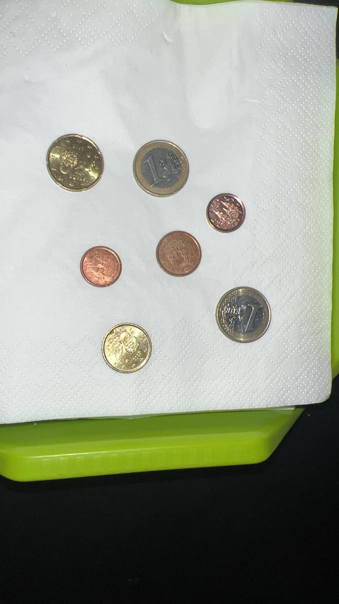

# Detección Interactiva de Monedas con OpenCV

Este proyecto permite identificar monedas en una imagen y calcular la cantidad total de dinero presente. El programa utiliza la librería OpenCV para el procesamiento de imágenes, y se puede interactuar con la imagen haciendo clic sobre una moneda de referencia (por ejemplo, una moneda de 1€), a partir de la cual se identifican todas las demás monedas en la imagen, calculando su valor total. 

## Descripción del Funcionamiento

### Objetivo

El objetivo de este programa es identificar monedas en una imagen, contarlas y determinar la cantidad total de dinero. El programa sigue los siguientes pasos:

1. **Carga de la imagen**: Se carga la imagen que contiene monedas no solapadas.
2. **Preprocesamiento de la imagen**:
   - Se convierte la imagen original a escala de grises.
   - Se aplica un suavizado con un filtro Gaussiano y otro con un filtro de mediana para reducir el ruido y mejorar la detección de los bordes.
3. **Detección de círculos**: Se usa la técnica de detección de círculos de Hough para encontrar las monedas en la imagen.
4. **Interactividad**: El usuario selecciona una moneda de referencia en la imagen (haciendo clic sobre una moneda conocida, por ejemplo, de 1€).
5. **Calibración y cálculo**: A partir de la moneda seleccionada, el programa calcula el tamaño de las demás monedas en la imagen, las clasifica según su diámetro y calcula el valor total de dinero en la imagen.
6. **Resultados**: El programa muestra los resultados por consola, incluyendo el valor total encontrado y una comparación entre las monedas reales y las detectadas.


### Pasos del Algoritmo

1. **Carga y conversión de imagen**:
   ```python
   img = cv2.imread('monedas2.jpeg')
   img_rgb = cv2.cvtColor(img, cv2.COLOR_BGR2RGB)
   gris = cv2.cvtColor(img, cv2.COLOR_BGR2GRAY)
   ```

2. **Suavizado de imagen**:
   Se aplican filtros para reducir el ruido y mejorar la precisión de la detección:
   ```python
   softenedImage = cv2.medianBlur(gris, 7)
   softenedImage2 = cv2.GaussianBlur(softenedImage, (5, 5), 1)
   ```

3. **Detección de círculos**:
   El programa utiliza la transformada de Hough para detectar los círculos (monedas):
   ```python
   circles = locateCirclesInIMG(softenedImage2)
   ```

4. **Interacción del usuario**:
   El usuario selecciona una moneda de referencia haciendo clic en la imagen:
   ```python
   cv2.setMouseCallback('Monedas', mouse_callback)
   ```

5. **Identificación y cálculo**:
   A partir de la moneda seleccionada, se calculan los tamaños de las demás monedas en la imagen, y se clasifican según su diámetro en diferentes tipos de monedas.
   
6. **Resultados**:
   El programa imprime por consola:
   - El valor total encontrado.
   - Comparación entre el número de monedas reales (esperadas) y las monedas detectadas.
   ```python
   showResults(moneyAmount, realMoneyAmount, coinCount, realCoinCount)
   ```

### Funciones Principales

- `locateCirclesInIMG(img)`: Detecta los círculos en la imagen utilizando la transformada de Hough.
- `coinDiameterInPixels(coin)`: Calcula el diámetro de una moneda en píxeles.
- `pixelMeasurementInCM(coinDiameterInPixels, coinDiameterInCM)`: Convierte el diámetro de píxeles a centímetros.
- `moneyCalculator(coins)`: Calcula el valor total de las monedas detectadas.
- `showResults(moneyAmount, realMoneyAmount, coinCount, realCoinCount)`: Muestra los resultados finales, incluyendo el valor total encontrado y las diferencias entre las monedas esperadas y las detectadas.

### Ejemplo de Ejecución



- El usuario selecciona una moneda de 1€ en la imagen haciendo clic sobre ella.
- El programa detecta y clasifica el resto de las monedas.
- Se imprime el siguiente resultado en la consola:

```
=== Resultados de Detección de Monedas ===
Dinero total real (esperado): 2.34 €
Dinero total encontrado: 2.34 €

Monedas reales (esperadas):
Moneda de 2.00 €: 0 unidades
Moneda de 1.00 €: 2 unidades
Moneda de 0.50 €: 0 unidades
Moneda de 0.20 €: 1 unidades
Moneda de 0.10 €: 1 unidades
Moneda de 0.05 €: 0 unidades
Moneda de 0.02 €: 1 unidades
Moneda de 0.01 €: 2 unidades

Monedas encontradas (detectadas):
Moneda de 2.00 €: 0 unidades
Moneda de 1.00 €: 2 unidades
Moneda de 0.50 €: 0 unidades
Moneda de 0.20 €: 1 unidades
Moneda de 0.10 €: 1 unidades
Moneda de 0.05 €: 0 unidades
Moneda de 0.02 €: 1 unidades
Moneda de 0.01 €: 2 unidades

Diferencias entre monedas reales y encontradas:
Moneda de 2.00 €: sin diferencia
Moneda de 1.00 €: sin diferencia
Moneda de 0.50 €: sin diferencia
Moneda de 0.20 €: sin diferencia
Moneda de 0.10 €: sin diferencia
Moneda de 0.05 €: sin diferencia
Moneda de 0.02 €: sin diferencia
Moneda de 0.01 €: sin diferencia

==========================================
```

### Problemas Observados

1. **Solapamiento de Monedas**: El programa puede tener dificultades al detectar monedas que están solapadas, ya que la técnica de Hough puede no distinguir bien los bordes.
2. **Monedas Similares en Tamaño**: Si dos monedas tienen un diámetro muy similar, pueden ser clasificadas incorrectamente, especialmente si la imagen tiene ruido o el suavizado no es adecuado.
3. **Iluminación y Reflejos**: Variaciones en la iluminación o reflejos sobre las monedas pueden afectar a la precisión del algoritmo de detección de bordes, provocando que algunas monedas no se detecten correctamente.

### Librerías Utilizadas

- **OpenCV**: Para el procesamiento de imágenes, detección de bordes y transformación de Hough.
- **NumPy**: Para manipular matrices y realizar cálculos con los píxeles de la imagen.
- **Matplotlib**: Para la visualización opcional de las imágenes (aunque no es utilizado directamente en este código).

### Requisitos

- Python 3.x
- OpenCV (`pip install opencv-python`)
- NumPy (`pip install numpy`)
